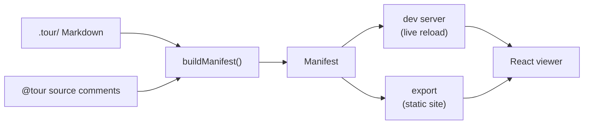

Welcome — you're looking at **`@tobisk/codesafari` explaining itself**. The pages,
the file tree, the Monokai code pane on the left of every step: all of it was
produced by this repository from the Markdown and the inline `@tour` comments it
ships with.

Two things turn source code into what you're reading:

1. **Authored Markdown** under `.tour/` — this overview, the component pages, the
   tour intros, and the glossary.
2. **Inline `@tour` comments** living next to the real code. Each one becomes a
   navigable step anchored to the class, function, or block that follows it.

The CLI stitches those together into a single [manifest](glossary:manifest), and
the React viewer renders it.

### Where to start

- The **How a manifest is built** tour walks the backend pipeline from the CLI
  down to cross-reference checking.
- The **How the viewer renders a tour** tour follows the frontend, ending at the
  [Code Hike](glossary:code-hike)-backed code pane you're reading this in.

Open either from the overview, or browse the components below.
