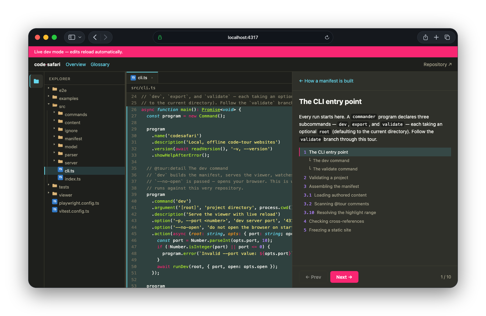

# @tobisk/codesafari

Turn a `.tour/` folder plus inline `@tour` source comments into a **local, offline code-tour website**.

`@tobisk/codesafari` is a self-contained TypeScript/React tool you run with `npx`. It reads authored Markdown and inline code comments, builds a manifest of your project's guided tours, and serves them through a VS Code-like read-only viewer with a Monokai theme. It can run live with file watching (`dev`) or emit a fully static, backend-free site (`export`).

**[Live demo →](https://kellertobias.github.io/codesafari/)**



> Status: **early development.** The content model, parser, and CLI (`validate`) are the first pieces landing. See [Roadmap](#roadmap).

## Why

Onboarding docs rot because they live away from the code. CodeSafari keeps the *narrative* next to the *source*:

- **Author overviews once** in `.tour/` Markdown (project, components, tours, glossary).
- **Anchor steps to real code** with `@tour slug:step Title` comments that live in the source and move with it.
- **Read it like an IDE** — a file tree, a scrollable read-only code viewer, and a step-by-step tour panel — with the freedom to "sneak around" and explore any file.
- **Ship it anywhere** — `export` produces static HTML/CSS/JS with source bundled in, so the site works offline with no server.

## Install / Run

No install required:

```bash
npx @tobisk/codesafari dev        # live server with file watching (default port 4317)
npx @tobisk/codesafari export     # emit a static site to ./codesafari-site
npx @tobisk/codesafari validate   # check content and report problems
```

Or add it to a project:

```bash
npm install --save-dev @tobisk/codesafari
```

### CLI

| Command | Description |
| --- | --- |
| `codesafari dev [root] --port 4317` | Build the manifest, serve the viewer, watch files, and live-reload. |
| `codesafari export [root] --out codesafari-site` | Write a frozen manifest, bundled source content, and static assets. |
| `codesafari validate [root]` | Parse all content and report errors (bad frontmatter, dangling links, unresolved steps, broken Mermaid). |
| `codesafari insert <spec> [root] --dry-run` | Write `@tour` comments into source files from a JSON spec. |

`root` defaults to the current directory. It must contain a `.tour/` folder.

## Content model

All authored content lives under `.tour/`. Markdown files use YAML frontmatter.

```
.tour/
  index.md                 # project overview + global defaults
  components/*.md          # software components
  tours/**/*.md            # tour entry pages
  glossary/**/*.md         # glossary concepts (one or many per file)
  docs/**/*.md             # standalone documentation pages (folders = structure)
  examples/**/*.md         # (v1.5) small self-contained code walkthroughs
```

### `.tour/index.md`

```markdown
---
title: My Project
description: What this project is.
defaultSnippetLines: 20
repositoryUrl: https://github.com/me/my-project   # optional
---

Landing-page introduction in Markdown.
```

### Components — `.tour/components/*.md`

```markdown
---
slug: queue-worker
title: Queue Worker
summary: Processes background jobs.   # optional
order: 10                             # optional
---

Description of the component in Markdown.
```

### Tours — `.tour/tours/**/*.md`

```markdown
---
slug: onboarding
title: Onboarding Tour
components: [queue-worker]     # optional
order: 1                       # optional
defaultSnippetLines: 30        # optional; overrides project default
---

Intro shown before the "Start tour" button.
```

### Glossary — `.tour/glossary/**/*.md`

One file may define many concepts using headings. Link to a concept from anywhere with an explicit Markdown link:

```markdown
See the [Queue worker](glossary:queue-worker) for details.
```

### Docs — `.tour/docs/**/*.md`

Standalone documentation pages for concepts that need more room than a glossary
entry and don't belong to any one tour. Drop in a Markdown file and it becomes a
page — no frontmatter or registration required.

**Folders are the navigation structure**, recursively. A folder's `index.md`
becomes that folder's own page, so a section can have prose as well as children;
a folder without one is a pure grouping node labelled from its name.

```
.tour/docs/
  index.md                 # the Docs landing page
  architecture/
    index.md               # the "Architecture" section's own page
    event-loop.md          # nested beneath it
  deployment.md            # a top-level page
```

Frontmatter is optional:

| Field | Effect |
| --- | --- |
| `title` | Page heading. Defaults to the leading `# Heading`, then the humanized file name. |
| `navTitle` | Shorter label for the navigation tree only. Defaults to `title`. |
| `order` | Sort key among siblings. Unordered pages sort last, alphabetically. |

A page's slug is its path under `.tour/docs/` without the extension. Link to one
from any Markdown in the project — a tour step, a component page, a glossary
concept, or another doc — with the `doc:` scheme:

```markdown
See [the event loop](doc:architecture/event-loop) for the full story.
```

Broken `doc:` links are reported by `codesafari validate`, just like broken
`glossary:` links. In the viewer, docs get their own navigation tree in the left
sidebar, under a book icon beneath the file-explorer icon.

## Inline tour comments

Anchor a tour step to code with a comment whose first line is:

```
@tour <tour-slug>:<step-order> <Step title>
```

The rest of the continuous comment block is the step body (full Markdown: inline code, links, images, `glossary:` links, and fenced ```mermaid``` diagrams).

```ts
// @tour onboarding:12.34 Enqueue a job
// The producer pushes work onto the queue. Downstream, the
// [Queue worker](glossary:queue-worker) drains it.
function enqueue(job: Job) { /* ... */ }
```

**Step order is dot-aware numeric.** `12.34` sorts before `12.45`; `12.2` sorts before `12.10`.

**Non-step callouts** render as styled annotations (not navigation steps):

```
// @tour comment Watch out
// This map is not thread-safe.
```

A callout is scoped to the step section it follows — it appears only while you're
on the nearest step above it in the file. A callout placed before every step in a
file applies to the whole file and shows whenever that file is open.

### How a step resolves its highlight

Given a step comment, the target range is chosen by what directly follows it:

- Directly before a **class** → the whole class.
- Directly before a **function/method** → that function/method.
- Directly before another **block** → that block.
- Otherwise → the comment plus the next `defaultSnippetLines` lines (tour-level value overrides the project default).

## Bulk-inserting steps

Placing `@tour` comments by hand is fiddly: consecutive `//`/`#` lines merge
into one comment block and only the first line is read as the header, so a
comment written under a doc comment — or under a Rust `#[derive(...)]`, which
the scanner also sees as a comment — silently stops being a step.

`insert` applies a JSON spec instead:

```json
[{
  "file": "src/auth/middleware.ts",
  "line": 42,
  "match": "export function requireSession",
  "tour": "authentication",
  "order": "10",
  "title": "The edge guard",
  "body": ["Every request passes through here first."]
}]
```

```bash
npx @tobisk/codesafari insert steps.json --dry-run
npx @tobisk/codesafari insert steps.json
```

`match` is the anchor and `line` only a hint — if the hint has drifted, the
match must still resolve uniquely nearby or the entry is reported rather than
guessed. The comment marker comes from the file type, the block is hoisted
above doc comments and attributes (but stays below decorators), insertions are
applied bottom-up, nothing is written unless every entry resolves, and entries
already present are skipped — so a corrected spec can be re-run safely. Use
`"tour": "comment"` for a callout.

## Diagrams

Fenced ```` ```mermaid ```` blocks in any `.tour/` Markdown or source-comment body are rendered locally to SVG — on demand during `dev`, and pre-rendered into static assets during `export`. Rendering never touches the network. `validate` reports the file and block for any diagram that fails to render.

## Authoring with a coding agent

The package ships an agent skill, [`skills/authoring-code-safaris`](skills/authoring-code-safaris/SKILL.md),
for generating a CodeSafari in *your* repository. It covers the content model
(glossary vs. components vs. tours), how to write `.tour/index.md`, which
components are worth a page, and which tours to generate — with a baseline of
authentication, the data layer, and the API for any server codebase. It asks
its clarifying questions up front, in one round, before writing anything.

```bash
mkdir -p .claude/skills
cp -R node_modules/@tobisk/codesafari/skills/authoring-code-safaris .claude/skills/
```

See [`skills/README.md`](skills/README.md) for Claude Code and Codex setup.

## Ignore rules

Files are excluded from parsing, serving, and export using `.gitignore` plus an optional `.codesafariignore` (same syntax). `.tour/` content is always included, even if a broad pattern would otherwise match it. Images referenced from source comments must be project-relative paths that are not ignored.

## Export output

`export` produces a self-contained directory:

- the prebuilt React viewer (HTML/CSS/JS),
- a frozen `manifest.json`,
- bundled readable source-file content,
- pre-rendered diagram SVGs and copied images.

It runs entirely offline and exposes every included source file.

## Languages

v1 parses **TypeScript/TSX, Rust, and Python** via Tree-sitter. Planned next: C/C++, Vue, Go, PHP.

## Roadmap

- **v1** — content model, ignore handling, dot-aware ordering, heuristic parsing, `validate` / `dev` / `export`, React viewer (Monokai), Mermaid diagrams.
- **v1.5** — small self-contained, state-based code **examples** authored in Markdown, attachable to tours, components, glossary concepts, or standalone.

The center code viewer sits behind an internal `CodeViewer` abstraction. **v1 uses [Code Hike](https://codehike.org)** (`codehike/code`): the CLI calls Code Hike's `highlight()` primitive directly, so authored tours stay pure Markdown — no MDX, no React authoring — while the viewer gets Code Hike's tokenizer, Monokai theme, and composable annotation handlers for line numbers and range highlighting. The abstraction keeps the door open to swapping in Monaco later without touching authored content.

### Try it on this repo

This repository tours itself. From the repo root:

```bash
npm run safari   # build the core + viewer, then serve the tour at http://localhost:4317
```

`npm run safari` runs CodeSafari on CodeSafari. The `.tour/` folder and the `@tour` comments throughout `src/` and `viewer/src/` drive a two-tour walkthrough of the codebase.

## Tests

Unit and integration tests run under Vitest; end-to-end tests drive the real
`dev` server with Playwright (headless Chromium), against this self-touring repo.

```bash
npm test          # unit + integration (Vitest)
npm run test:e2e  # end-to-end viewer tests (Playwright)
```

The e2e suite exercises the landing page, the file-tree toggle, and stepping a
tour. One spec (`e2e/screenshot.spec.ts`) also captures the viewer with the file
tree and a file open, which powers the README screenshot:

```bash
npm run screenshot
```

`npm run screenshot` runs that one spec to write `docs/viewer-explorer.png`, then
wraps it in dark-mode Safari chrome with the vendored
[browsershot](https://github.com/kellertobias/browsershot) tool
(`scripts/browsershot`, run in an isolated Python venv) to produce
`docs/viewer-explorer.safari.png` — the image shown at the top of this README.
The framing step needs macOS; on other platforms the raw capture is still written.

## License

MIT © CodeSafari contributors
