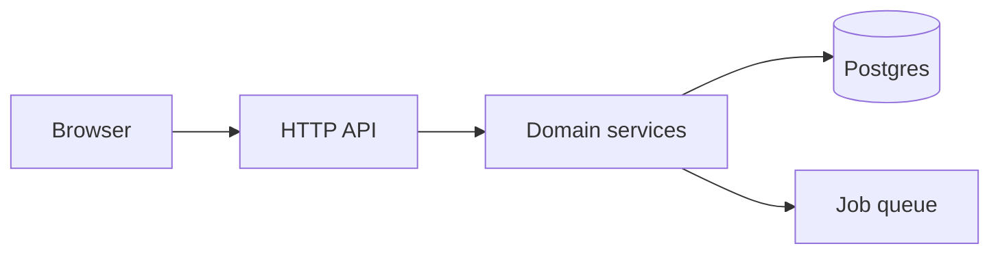

# Authoring Code Safaris

You are adding **CodeSafari** content to a codebase. CodeSafari
(`@tobisk/codesafari`) reads a `.tour/` folder plus `@tour` comments in the
source and serves them as an offline, IDE-like guided tour site.

Your job is to produce **content**, not to modify the tool. Never change
application logic to make a tour nicer; the tour bends to the code.

---

## 0. Ask first — before writing anything

Read enough of the repo to form an opinion, then ask the user a **single
batched round** of questions. Propose your own answers so the user can just
confirm. Do not start authoring until this round is answered.

Ask about:

1. **Audience** — new hires joining the team? external contributors? both?
   (Changes how much domain context the glossary must carry.)
2. **The tour list you propose** — show the concrete list you derived in §4
   ("I plan: Authentication, Data layer, HTTP API, Billing. Add/remove?").
3. **The component list you propose** — the §3 breakdown.
4. **Scope of code** — any packages, generated dirs, or vendored trees to leave
   out of the safari entirely (these become `.codesafariignore` entries).
5. **Unknowns you could not answer from the code** — why a surprising design
   exists, which of two similar paths is the blessed one, what is deprecated.
   These are the parts of a tour you cannot invent, so collect them here.

If the user is unavailable (non-interactive run), write your assumptions into
the top of `.tour/index.md` as a short "Assumptions" note and continue.

---

## 1. The four content kinds — keep them distinct

CodeSafari has four kinds of authored content. Newcomers to the format blur
them; don't.

| Kind | Answers | Shape | Lives in |
| --- | --- | --- | --- |
| **Glossary concept** | "What does this *word* mean?" | A paragraph or two. No navigation. | `.tour/glossary/**/*.md` |
| **Component** | "What is this *part of the system* and where does it live?" | A static page with links into the code. | `.tour/components/*.md` |
| **Tour (CodeSafari)** | "How does this *flow* actually work, step by step?" | An intro page + ordered `@tour` steps in the source. | `.tour/tours/**/*.md` + `@tour` comments |
| **Doc page** | "Explain this *idea* properly, at length." | Long-form prose, nested in folders. Not anchored to code. | `.tour/docs/**/*.md` |

Decision rule when you are unsure which one a piece of writing is:

- If it defines vocabulary the reader needs *while reading something else* →
  **glossary**. Signal: you keep wanting to explain the same word in three
  places. Write it once and link it: `[dot-aware ordering](glossary:dot-aware-ordering)`.
- If it describes a *place* — a directory, module, service, package — that the
  reader will return to → **component**.
- If it describes a *journey through time* — a request, a login, a job being
  processed → **tour**.
- If it needs *more than a couple of paragraphs* and isn't tied to specific
  lines of code — a design rationale, a protocol, a threat model, a migration
  history → **doc page**. Signal: a glossary entry that keeps growing headings.

A concept is never a tour. "JWT" is a glossary entry; "How a login request
becomes a session" is a tour. A component is never a tour either: "Auth
service" is a component; the login flow *through* it is the tour. And a doc page
is never a tour: "Why we chose opaque tokens over JWTs" is a doc; the code path
that mints one is a tour.

---

## 2. `.tour/index.md` — the project summary

`index.md` is the landing page and the only global config. Write it **first**,
after the question round. It sets the frame everything else hangs off.

~~~markdown
---
title: Acme Platform
description: One sentence a stranger could repeat back correctly.
defaultSnippetLines: 20
repositoryUrl: https://github.com/acme/platform   # optional
---

Two to four short paragraphs: what the product does, the runtime shape
(monolith? services? worker + web?), and the one or two design decisions that
explain the rest of the codebase.



### Where to start

- **Authentication** — how a request proves who it is.
- **Data layer** — how domain objects reach and leave the database.
~~~

Rules:

- `description` is one sentence, no marketing.
- Include exactly one high-level `mermaid` diagram of the runtime topology.
  Diagrams render locally and offline; never link an external image service.
- End with a **"Where to start"** list naming the tours in reading order. This
  is the single most useful thing on the page.
- `defaultSnippetLines` (typically 15–25) is the fallback highlight size when a
  step does not sit in front of a class/function/block.

---

## 3. Choosing which components to show

Components are the map. Aim for **5–12**. Fewer and the map is useless; more
and it is a directory listing.

Include a component when **all** of these hold:

- It has a **name the team actually says out loud** ("the ingest worker", not
  "utils").
- A reader could be **assigned a ticket** scoped to it.
- It owns a **coherent responsibility**, not just a folder that exists.

Exclude:

- Leaf utility/helper/type-only directories.
- Generated code, migrations, vendored dependencies, build output.
- Anything you would describe as "and various other files".

Derive candidates from, in order of reliability: top-level source directories,
package/workspace boundaries, deployable units (services, workers, CLIs), and
finally the module clusters you observe from import graphs. Prefer the
project's own vocabulary over an invented taxonomy.

Each component page:

```markdown
---
slug: auth-service          # kebab-case, stable, referenced by tours
title: Auth Service
summary: Issues and verifies sessions.   # one line, shown in listings
order: 20                                # 10, 20, 30… leaves room to insert
---

What it is responsible for, and — just as usefully — what it is *not*.

- [`src/auth/session.ts`](src/auth/session.ts) — issuing and refreshing sessions.
- [`src/auth/middleware.ts`](src/auth/middleware.ts) — the guard applied per route.

Sessions are opaque [session tokens](glossary:session-token), not JWTs; see the
[Authentication](#) tour for the full flow.
```

Link to real files with project-relative Markdown links. Verify every path
exists before you write it.

---

## 4. Choosing which CodeSafaris to generate

Tours are for **major features and concepts** — the flows a newcomer must
understand before they can safely change anything.

### Baseline for any codebase with a server

Unless the repo genuinely lacks the concern, always produce:

1. **Authentication & authorization** — how an incoming request acquires an
   identity, where that identity is checked, and what happens when it fails.
   Start at the entry point (middleware/guard), not at the user model.
2. **The data layer** — how a domain object is read and written: schema or
   model definition → repository/query layer → transaction boundaries →
   migrations. Show one complete round trip, not a catalogue of tables.
3. **The API surface** — almost always worth it: route registration →
   validation → handler → domain call → serialized response. Trace *one*
   representative endpoint end to end rather than surveying many.

### Then the feature tours

Add one tour per **major feature or core concept** the product is actually
about — the things named on a roadmap: billing, ingestion pipeline, search
indexing, permissions model, real-time updates, the rendering pipeline.

Test a candidate tour against these:

- Can it be told as an **ordered sequence** with a beginning and an end?
- Does it cross **more than one component**? (Single-file flows are usually a
  component page plus callouts, not a tour.)
- Would a new hire's **first week be worse** without it?

Do not generate tours for: build tooling, test setup, formatting config,
CI, or "misc utilities". Mention those in `index.md` if at all.

**Sizing.** 8–20 steps per tour. Under 5 steps, fold it into a component page.
Over ~25, split it (e.g. "Login" and "Session refresh" instead of one "Auth").
Total: aim for 3–7 tours in a normal repo. Every tour you write must be one
someone will finish.

### Tour entry page

```markdown
---
slug: authentication
title: How a request proves who it is
components: [auth-service, http-api]   # slugs from .tour/components
order: 1                               # reading order on the landing page
defaultSnippetLines: 25                # optional override
---

Follow one authenticated request from the edge middleware down to the loaded
user, then look at the two ways it can fail.
```

Give tours **action titles** ("How a manifest is built"), not noun labels
("Manifest"). The noun label belongs to the component.

---

## 5. Writing the steps (`@tour` comments)

Steps live in the source, next to the code they describe, so they move with it.

```ts
// @tour authentication:10 The edge guard
// Every request passes through here first. The guard reads the
// [session token](glossary:session-token) cookie and, on success, attaches the
// resolved user to the request before any handler runs.
export function requireSession(req, res, next) { /* ... */ }
```

- Header line: `@tour <tour-slug>:<order> <Step title>`.
- Everything after it in the **same continuous comment block** is the step
  body — full Markdown, including `glossary:` links and ```` ```mermaid ````
  blocks.
- **Ordering is dot-aware**, not decimal: `12.2` sorts before `12.10`. Number
  steps `10, 20, 30…` so later insertions land as `15` or `12.5` with no
  renumbering.
- The **highlight range** is chosen by what directly follows the comment: a
  class highlights the whole class; a function/method highlights that
  function; another block highlights the block; otherwise the comment plus
  `defaultSnippetLines` lines. So **place the comment directly above the
  construct you want shown** — a blank line or a stray import in between
  changes what the reader sees.

Non-navigable annotations use `@tour comment`:

```ts
// @tour comment Not thread-safe
// This cache is intentionally per-process; see the data layer tour.
```

A callout is scoped to the nearest step **above** it in the same file. A
callout placed before every step in a file applies file-wide.

### Inserting the comments — use `codesafari insert`

Do **not** write a helper script to place these comments, and do not compute
line numbers and edit by offset. Placement is subtle enough that the CLI does
it for you:

```bash
npx @tobisk/codesafari insert steps.json --dry-run   # resolve and report
npx @tobisk/codesafari insert steps.json             # apply
```

`steps.json` is an array; `match` is the real anchor and `line` is only a hint:

```json
[
  {
    "file": "src/auth/middleware.ts",
    "line": 42,
    "match": "export function requireSession",
    "tour": "authentication",
    "order": "10",
    "title": "The edge guard",
    "body": [
      "Every request passes through here first.",
      "On success it attaches the resolved user before any handler runs."
    ]
  },
  {
    "file": "src/auth/cache.ts",
    "match": "const cache = new Map",
    "tour": "comment",
    "title": "Not thread-safe"
  }
]
```

Each body array element is a separate Markdown paragraph. Use `"tour":
"comment"` for a callout (omit `order`).

The command handles what hand-editing gets wrong:

- Picks `//` or `#` from the file type, and refuses file types it doesn't know
  rather than guessing.
- Verifies `match` is on the anchor line; if the line hint has drifted it
  searches nearby and requires a **unique** hit. Ambiguous or missing anchors
  are reported, never guessed.
- Places the block **above preceding doc comments and attributes**, with a
  blank line after. This matters: consecutive `//`/`#` lines merge into one
  comment block and only the first line is read as the `@tour` header — and a
  Rust `#[derive(...)]` counts as a `#` comment to the scanner. It stays
  *below* decorators (`@app.route`), which are code, so the `def`/`class`
  underneath stays the resolved anchor.
- Applies bottom-up per file, so earlier anchors don't drift.
- Is **all-or-nothing**: if any entry fails to resolve, no file is written.
- Is **idempotent**: an entry whose header is already in the file is skipped,
  so fixing a spec and re-running cannot duplicate comments.

Write the whole tour as one spec and apply it in one run. If it reports
problems, fix the spec and re-run — that is safe by design.

### Step prose style

- Write what the reader **cannot** see in the code: why, trade-offs, what
  breaks, which alternative was rejected. Never narrate the syntax.
- 2–5 sentences. If a step needs more, it is two steps.
- First step of a tour sets the scene; last step says where the flow ends and
  what to read next.
- Link vocabulary to the glossary instead of re-explaining it.

---

## 6. Glossary

One file may hold many concepts, one per `##` heading; the slug is derived
from the heading. Link with `[Label](glossary:the-slug)`.

```markdown
## Session token

An opaque, random 32-byte value stored in Redis and mapped to a user id.
Deliberately not a JWT: revocation must be immediate, so the check hits the
store on every request. See [`src/auth/session.ts`](src/auth/session.ts).
```

Write an entry for any term that is **domain-specific, internally invented, or
used in a non-standard way**. Skip industry-standard terms unless this codebase
means something unusual by them.

When an entry outgrows two paragraphs, move the body to a doc page and leave the
glossary entry as a one-line definition plus a `doc:` link.

---

## 6b. Doc pages

For prose that needs room: design rationale, protocols, threat models, "how our
caching actually works". Drop a Markdown file under `.tour/docs/` — no
frontmatter required. **Folders are the navigation structure**, recursively, and
a folder's `index.md` is that folder's own page.

```
.tour/docs/
  index.md               # Docs landing page
  caching/
    index.md             # the "Caching" section page
    invalidation.md      # nested beneath it
```

Optional frontmatter: `title` (defaults to the leading `# Heading`, then the
file name), `navTitle` (shorter tree label), `order` (sort among siblings).

Link from anywhere — a step body, a component, a glossary entry, another doc —
with the `doc:` scheme, using the path under `.tour/docs/` without the extension:

```markdown
See [cache invalidation](doc:caching/invalidation).
```

Keep doc pages out of step bodies' critical path: a step should stand alone and
*offer* the doc as a deeper read, not require it.

---

## 7. Verify before you report done

```bash
npx @tobisk/codesafari validate    # frontmatter, dangling links, unresolved steps, diagrams
npx @tobisk/codesafari dev         # optional: view it at http://localhost:4317
```

`validate` must pass with zero errors. Then check by hand:

- Every `slug` referenced in a tour's `components:` exists.
- Every `glossary:` and `doc:` link resolves.
- Every file path linked from Markdown exists.
- Every tour has a step `1`-equivalent and reads in order.
- No tour references a file excluded by `.gitignore` / `.codesafariignore`.

Report to the user: the tours and components you created, the questions you had
to assume answers to, and anything you deliberately left untoured.

---

## Working agreements

- Read the code before writing about it. A confidently wrong tour is worse than
  no tour.
- Prefer fewer, finished tours over broad coverage.
- Reuse the repo's own naming. If the team says "workspace", never write
  "tenant".
- Keep `.tour/` Markdown and `@tour` comments consistent in voice: direct,
  second person, present tense.
